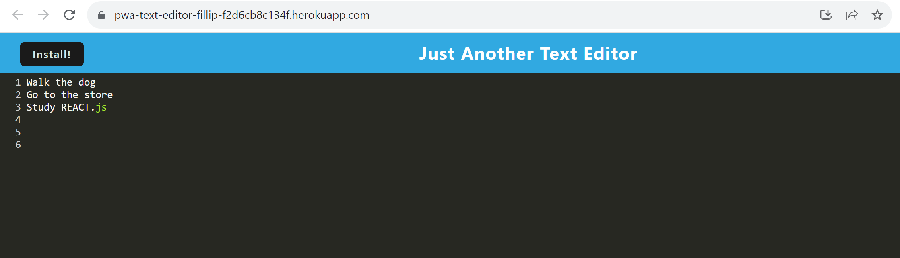

# pwa-text-editor 

---
## Description
    
Full Stack Web Application that allows for stored notes in indexDB and can be downloaded as a progressive web application offline.

---    
## Table of Contents

+ **[Installation](#installation)**
+ **[Usage](#usage)**
+ **[License](#license)**
+ **[Contributing](#contributing)**
+ **[Tests](#tests)**

---  
## Installation
    
npm i
npm run start:dev

---    
## Usage
    
The reason behind the file is to display my ability to use workbox webpack in tandem with node.js, js, css, and html to build a progressive web application that is user friendly. 

---    
## License
    
MIT

---
## Contributing
    
UDenver Bootcamp

---
## Tests

none

---
## Questions

**Contact Me:**
Email: [nick.m.fillip@gmail.com](nick.m.fillip@gmail.com)
Cell: (281) 216 - 2183
Github Profile: [https://github.com/nfillip](https://github.com/nfillip)

---

    

## Website
Github Repo: [https://github.com/nfillip/social-network-mongoDB](https://github.com/nfillip/social-network-mongoDB) 
Heroku Deployed Website: [https://pwa-text-editor-fillip-f2d6cb8c134f.herokuapp.com/](https://pwa-text-editor-fillip-f2d6cb8c134f.herokuapp.com/)

---
© 2023 nfillip LLC. All Rights Reserved.